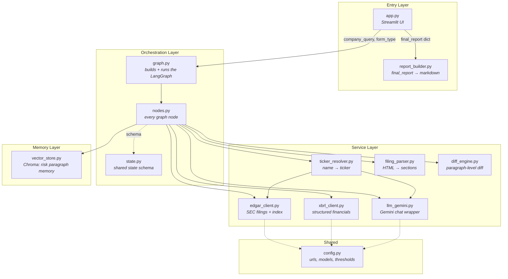
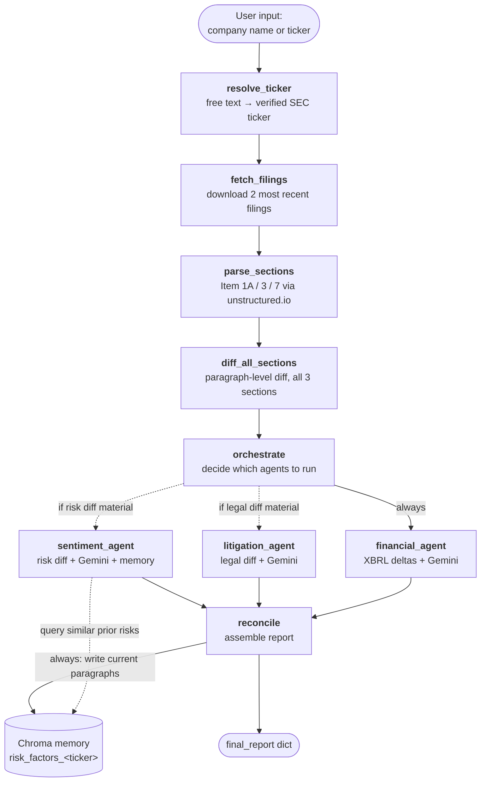
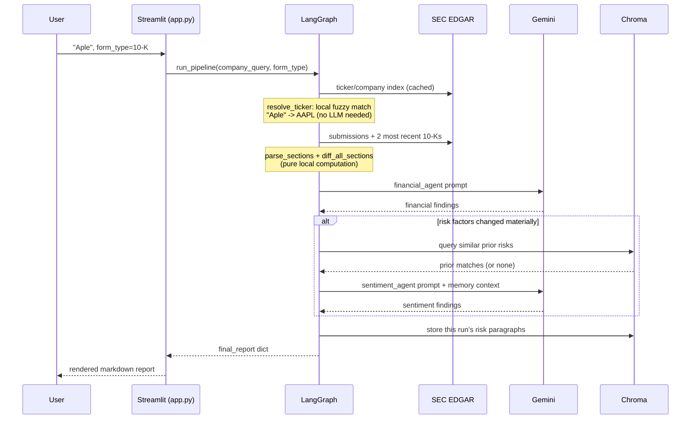

# SEC Filing Intelligence & Risk-Delta Agent — Documentation

## 1. Problem Statement

Analysts and small funds can't manually track how risk factors, litigation
exposure, or accounting language change across a company's quarterly and
annual SEC filings. Material changes — a new "going concern" clause, freshly
disclosed litigation, a softened or hardened risk statement — are often
buried in dense, inconsistently structured 10-K/10-Q text and tables, and
the only reliable way to catch them today is to read two multi-hundred-page
filings side by side. That doesn't scale past a handful of tickers.

The goal of this project is to automate that comparison end-to-end: given
just a company name, pull its two most recent filings, isolate the sections
that actually matter (Risk Factors, Legal Proceedings, MD&A), and produce a
structured delta report — without requiring the user to already know the
company's ticker, and without spending LLM calls on filings that didn't
meaningfully change.

## 2. Agentic Solution Design & Reasoning

### Why a graph instead of a fixed script

A naive version of this tool is a linear script: fetch two filings, diff
them, summarize with one LLM call. Two things break that approach in
practice:

- **Different sections need different expertise.** A litigation delta and a
  risk-sentiment delta call for different system prompts, different framing,
  and different reasoning — cramming them into one generic "summarize this"
  call produces shallow output. Specialist agents solve this the same way a
  research team would: different analysts for different domains.
- **Most filings don't change most sections.** Boilerplate risk factors are
  routinely copy-pasted quarter to quarter. Running every specialist agent
  on every filing wastes LLM calls on sections that are byte-for-byte
  identical to the prior period.

LangGraph's `StateGraph` with `add_conditional_edges` solves both: each
specialist is its own node with its own prompt, and the **orchestrator**
node decides at runtime — based on the actual diff output, not a fixed rule
— which specialists are worth invoking. See §4.4 below for the reasoning
this decision is built on.

### Why ticker resolution is its own upstream step

The original design assumed the user already knew the ticker. In practice,
most people know a company by name, not symbol, and get it slightly wrong
("Aple", "Mircosoft") or use an informal name ("the iPhone company"). Two
bad options existed: ask the user to always type an exact ticker (poor UX),
or trust an LLM's raw ticker guess (risky — LLMs hallucinate ticker symbols
with total confidence).

The solution is a **two-tier resolver that never blindly trusts the LLM**:
cheap local fuzzy matching against SEC's real ~13,000-company list first
(instant, free, handles typos and direct tickers); the LLM is only consulted
for names a string-matcher genuinely can't handle, and even then its guess
gets re-verified against the same real SEC list before being accepted. If
neither step is confident, the system surfaces candidates instead of
guessing — a wrong silent guess would poison every downstream node.

### Why long-term memory matters here specifically

A single-filing diff can only ever say "this paragraph is new" or "this
paragraph was reworded." It has no way to know that a risk which vanished
last quarter and reappeared this quarter, worded differently, is the *same*
underlying risk resurfacing — which is exactly the kind of pattern an
analyst actually cares about. A Chroma vector store gives `sentiment_agent`
a memory of every risk paragraph seen in prior runs, so it can tell a
genuinely novel risk apart from a recurring one dressed in new language.

### Why prompts are written per-agent, not generically

Each specialist's system prompt encodes the reasoning pattern of that
specific domain professional, not a generic "you are a helpful assistant":
`financial_agent` is told to be "a precise, skeptical equity research
analyst. No fluff." — deliberately excluding hedging language and boilerplate
caveats that a general-purpose prompt tends to produce. `litigation_agent`
is asked specifically to flag new lawsuits, settlements, or a change in
tone. `sentiment_agent` is asked for a bounded −5-to-+5 score, forcing a
comparable, structured output instead of free-form prose. This is what
"effective prompting based on domain knowledge" means in practice here: the
prompt shape mirrors how a real analyst in that specific role would frame
the question, not a one-size-fits-all instruction.

## 3. Diagrams

### 3.1 Module architecture

### 3.2 LangGraph node & state flow

Solid edges always fire on every run. Dashed edges are conditional — they
only fire when `orchestrate` decides a section changed materially enough to
warrant a specialist, or when `sentiment_agent` actually runs and queries
memory.

### 3.3 Request sequence (one full run)

## 4. Source Code Highlights, Mapped to Technical Key Terms

### 4.1 Extensive automated HTML docs parsing (unstructured, BeautifulSoup, regex)

**File:** `src/parsing/filing_parser.py`

- `partition_filing()` runs SEC HTML through `unstructured.partition.html.partition_html`,
  which classifies every block (`NarrativeText`, `Title`, `Table`, ...)
  instead of returning one flat string — the mechanism that keeps tables
  distinct from surrounding prose (`extract_sections_structured()`).
- `ITEM_PATTERN`, a regex tolerant of dash/colon/em-dash variants after the
  item number, locates every "Item 1A."-style header; the parser keeps only
  the *last* occurrence of each item number to skip the table of contents.
- `_extract_sections_bs4_fallback()` is a second, independent parsing path
  using BeautifulSoup + the same regex logic, which kicks in automatically
  if `unstructured` isn't installed or throws on a malformed document — so
  the pipeline degrades gracefully instead of hard-failing on parsing alone.

### 4.2 Proper use of fuzzy logic with LLM

**Files:** `src/data/ticker_resolver.py`, `src/diffing/diff_engine.py`

- `ticker_resolver.py` never lets the LLM's output become a ticker directly.
  `resolve_ticker()` runs `rapidfuzz` fuzzy matching against SEC's real
  company list first; only when that's weak does it call the LLM, and even
  the LLM's guess is immediately re-run through the *same* fuzzy matcher
  before being accepted — fuzzy logic is the verification layer around the
  LLM, not a replacement for it.
- A corporate-suffix stripper (`_normalize()`) removes boilerplate like
  "Inc.", "Corp", "Holdings" before scoring, since suffixes were found (via
  direct measurement) to suppress true match scores for short typos.
- `diff_engine.py`'s `diff_sections()` uses `rapidfuzz.fuzz.token_sort_ratio`
  to distinguish a *reworded* risk paragraph from a *genuinely new* one
  during a `difflib` `replace` opcode — fuzzy string similarity used to
  disambiguate structural diff output, not just for search.

### 4.3 Effective prompting based on domain knowledge

**File:** `src/agents/nodes.py`

Each specialist agent's system prompt is written to reflect how that
specific professional actually reasons, not a generic instruction — see
§2 above for the reasoning behind each one:

- `financial_agent`: *"You are a precise, skeptical equity research
  analyst. No fluff."*
- `litigation_agent`: framed to specifically extract new filings,
  settlements, and tone shifts from the raw added/removed/reworded
  paragraph lists.
- `sentiment_agent`: asks for a bounded −5-to-+5 risk-sentiment score and
  is fed prior-quarter memory context so it can explicitly separate
  "genuinely new risk" from "recurring risk in different words."

### 4.4 Automated orchestration using LangGraph

**Files:** `src/agents/graph.py`, `src/agents/nodes.py`

- `orchestrate()` builds `route_to` dynamically from `summarize_diff()`'s
  `material_change_signal` on each section's diff — `financial_agent` is
  unconditional, `litigation_agent` and `sentiment_agent` are conditional.
- `graph.py`'s `add_conditional_edges("orchestrate", route_condition, {...})`
  is what turns that decision into a true multi-node fan-out at runtime.
- Every node returns **only its own new state keys**, never the full state
  via `{**state, ...}` — a deliberate fix for a real bug encountered during
  development (`InvalidUpdateError: Can receive only one value per step`)
  caused by parallel agent branches all claiming to write every shared key
  simultaneously.

### 4.5 Proper use of memory with agents

**Files:** `src/memory/vector_store.py`, `src/agents/nodes.py`

- Memory is **queried before it's written** within a single run:
  `sentiment_agent` calls `find_similar_prior_risks()` first, so it only
  ever matches against *past* runs, never against paragraphs from the run
  currently in progress.
- `reconcile()` writes the current run's risk paragraphs to memory
  **unconditionally**, regardless of which agents fired — every run grows
  the record, not just the ones that triggered a sentiment analysis.
- `store_risk_paragraphs()` uses `col.upsert()`, not `.add()`, so re-running
  the pipeline against an already-indexed filing overwrites cleanly instead
  of crashing on duplicate IDs.
- Memory is scoped per-ticker (`risk_factors_<ticker>` as the Chroma
  collection name), so one company's risk history never leaks into another
  company's similarity search.

### 4.6 Compact Python programming skills

- `src/agents/state.py`: the entire cross-node contract is one `TypedDict`
  with `total=False`, avoiding a class hierarchy for what is, functionally,
  a dictionary with known optional keys.
- `src/diffing/diff_engine.py`: `SectionDiff` and `ParagraphChange` are
  `@dataclass`-based value objects — comparison logic stays declarative and
  free of manual `__init__`/`__repr__` boilerplate.
- `src/data/edgar_client.py`, `src/data/ticker_resolver.py`: module-level
  caching (`functools.lru_cache`, lazy-built globals) avoids re-downloading
  SEC's ~13,000-row company index on every call, without introducing a
  caching framework for a single-process app.
- Consistent type hints (`list[dict]`, `tuple[str, str]`, `Optional[str]`)
  throughout every public function signature, keeping the module boundaries
  self-documenting without a separate interface layer.
- `state.py` reflects the project's actual settled design, not its full
  history: an earlier iteration explored an HF-with-Gemini-fallback setup
  and tracked `financial_provider` / `litigation_provider` / `sentiment_provider`
  keys so a report could show which LLM answered each section. Once the
  project consolidated on Gemini as the single provider, that tracking
  became redundant and was removed from the state schema rather than kept
  as dead weight.

## 5. Setup & Usage

See [`README.md`](./README.md) for installation, environment variables, and
the standalone demo script.
